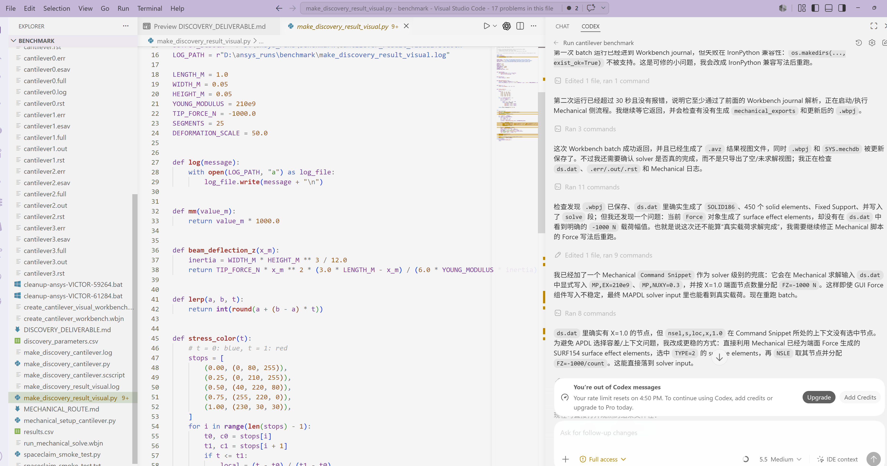
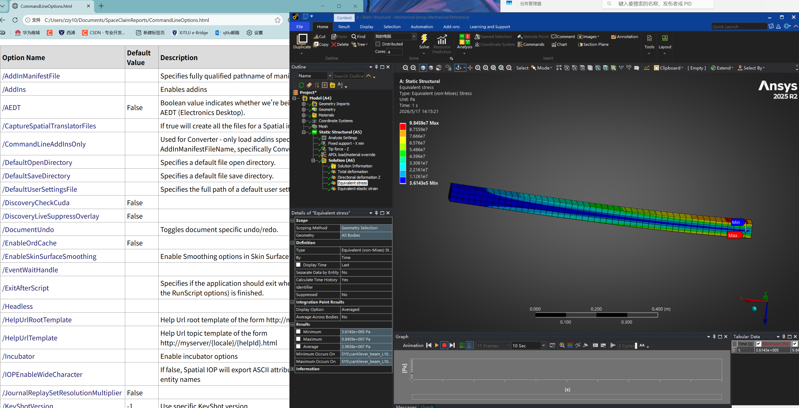

# ANSYS_skill

A Codex Skill for reliably driving Ansys Mechanical MVP simulations.

This repository is not trying to become a broad CAE platform. Its core job is narrower and more useful:

```text
Codex -> Ansys Workbench Mechanical -> evaluated, viewable, verifiable result evidence
```

The final acceptance criterion is not "the object exists"; it is:

```text
Mechanical shows contour, legend, non-empty Min/Max values, and the Workbench project is saved.
```

That distinction is the project. The skill exists because LLM agents can create geometry, result objects, or project files that look close to done while the actual Mechanical result is still unevaluated.

## Scope

Primary scope:

- stable Codex operating protocol for Ansys Mechanical MVP simulations
- repeatable Discovery or SpaceClaim geometry handoff into Workbench Mechanical
- Mechanical mesh, boundary condition, load, solve, evaluate, save loop
- delivery verification for `.wbpj`, `_files`, `.mechdb`, `ds.dat`, and exported evidence
- failure-aware recovery prompts for common Codex and GUI automation mistakes

Out of scope for now:

- broad multi-solver CAE platform design
- dashboards, cloud execution, PyDPF postprocessing, or large benchmark databases
- claiming engineering production validity from filesystem checks alone

## Repository Layout

```text
skill/
  SKILL.md
  mechanical_mvp_protocol.md
  failure_taxonomy.md
  recovery_prompts.md
ansys-mechanical-mvp/
  SKILL.md
  agents/
  references/
  scripts/
    check_mechanical_delivery.py
src/
  ansys_skill_platform/
    cli.py
    validators/
    benchmarks/
tests/
assets/
  images/
```

The canonical workflow instructions live in `skill/`. The `ansys-mechanical-mvp/` folder remains the installable compatibility skill and script bundle.

## Strong Protocol

Use this fixed path for Mechanical MVP delivery:

1. Create geometry.
2. Save Workbench project.
3. Enter Mechanical.
4. Assign material.
5. Generate mesh.
6. Apply fixed support and force.
7. Solve.
8. Evaluate result.
9. Verify contour, legend, and Min/Max.
10. Export evidence and save the project.

Each protocol step has:

- Goal
- Required action
- Do not do
- Success signal
- Failure recovery

See [mechanical_mvp_protocol.md](skill/mechanical_mvp_protocol.md).

## Failure Taxonomy

This project focuses on failures that happen when Codex drives complex engineering GUI workflows:

- Object exists but result is not evaluated.
- Project saved but `_files` folder is incomplete.
- Mechanical tree has result object but no contour.
- Solver input exists but no solved state.
- Codex stops after geometry creation.
- GUI state and filesystem state disagree.

See [failure_taxonomy.md](skill/failure_taxonomy.md) and [recovery_prompts.md](skill/recovery_prompts.md).

## Verification Gate

The checker is a Codex workflow verification gate. It does not prove physics correctness.

```powershell
python .\ansys-mechanical-mvp\scripts\check_mechanical_delivery.py `
  "D:\ansys_runs\benchmark\cantilever_workbench.wbpj" `
  --exports "D:\ansys_runs\benchmark\mechanical_exports"
```

Expected gate language:

```text
PASS: Workbench project exists
PASS: Workbench _files directory exists
PASS: Mechanical database exists
PASS: solver input exists
PASS/WARN: exported result evidence status
WARN: cannot confirm GUI contour from filesystem
FAIL: no Mechanical database
```

The Python package exposes the same gate for development use:

```powershell
$env:PYTHONPATH = ".\src"
python -m ansys_skill_platform.cli validate `
  "D:\ansys_runs\benchmark\cantilever_workbench.wbpj" `
  --exports "D:\ansys_runs\benchmark\mechanical_exports"
```

## Visual Before And After

### Before: Object Exists But Result Is Not Evaluated

The result object exists in the Mechanical tree, but there is no real contour and the Min/Max fields are blank or red. This is not accepted.



### After: Evaluated Mechanical Contour

The accepted target is a colored contour with legend, visible Min/Max markers, and populated numerical result values.



## Status Words

Use precise language:

- `Geometry ready`: Discovery or SpaceClaim geometry exists.
- `Project ready`: `.wbpj` and matching `_files` exist.
- `Setup ready`: Mechanical has material, mesh controls, supports, loads, and result objects.
- `Solver input generated`: files such as `ds.dat` exist.
- `Solved/evaluated`: Mechanical shows contour, legend, and non-empty Min/Max values.

Never collapse these into one "done" status.

## Development

Run tests:

```powershell
$env:PYTHONPATH = ".\src"
python -m unittest discover -s tests
```

Run the configured demonstration workflow:

```powershell
$env:PYTHONPATH = ".\src"
python -m ansys_skill_platform.cli run .\examples\cantilever_workflow.yaml
```

The workflow runner is secondary. The main deliverable is the repeatable Codex skill protocol and the Mechanical delivery gate.
