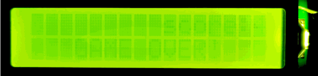
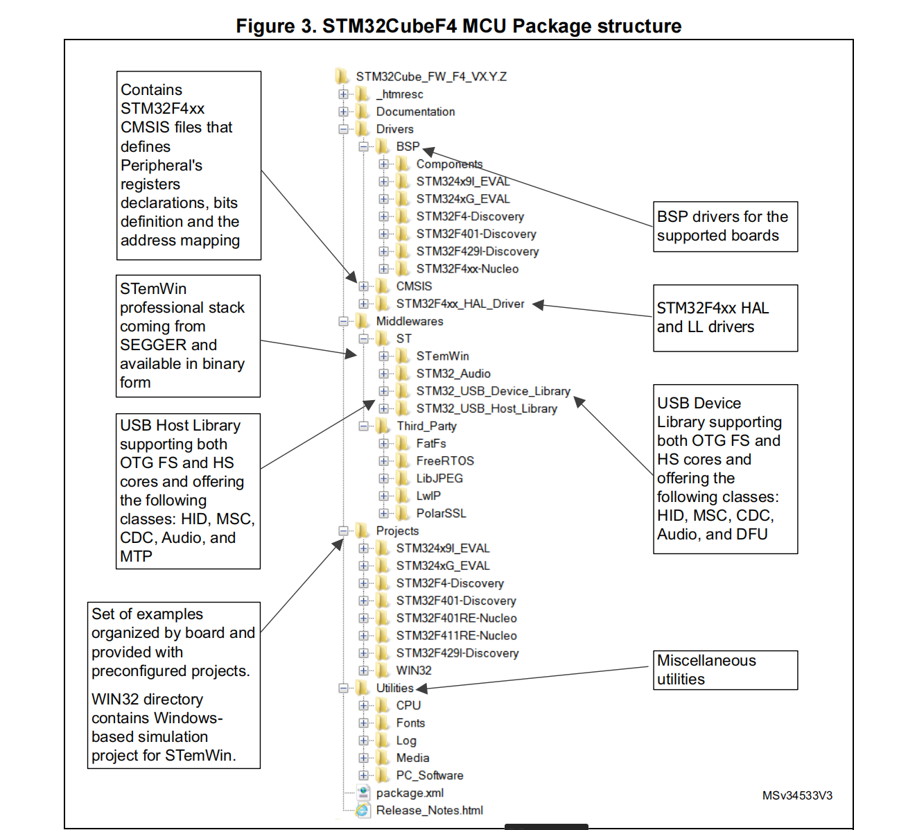
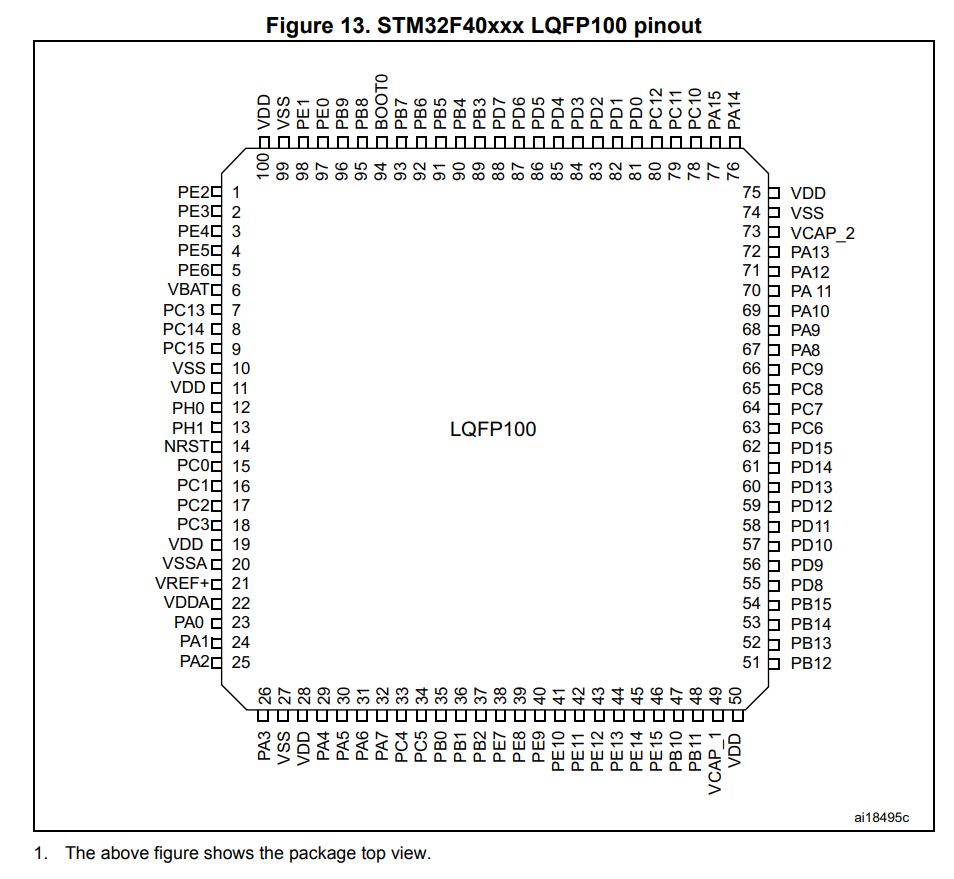
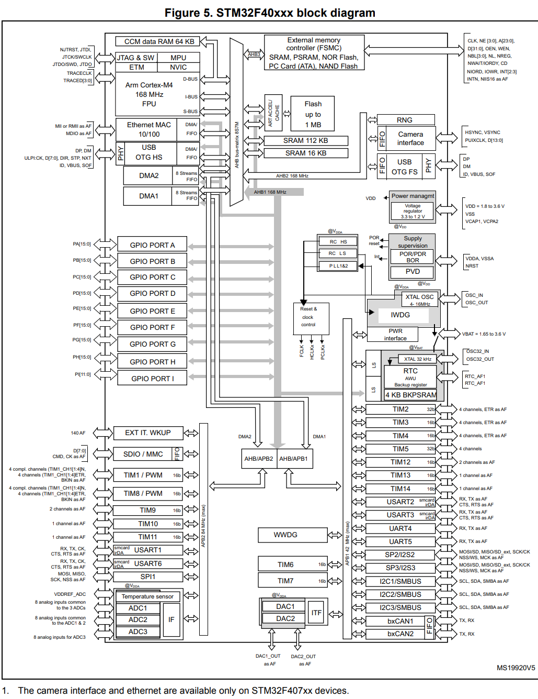
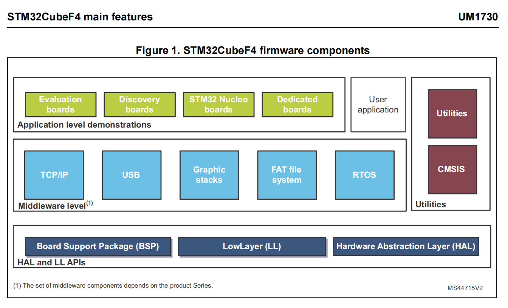
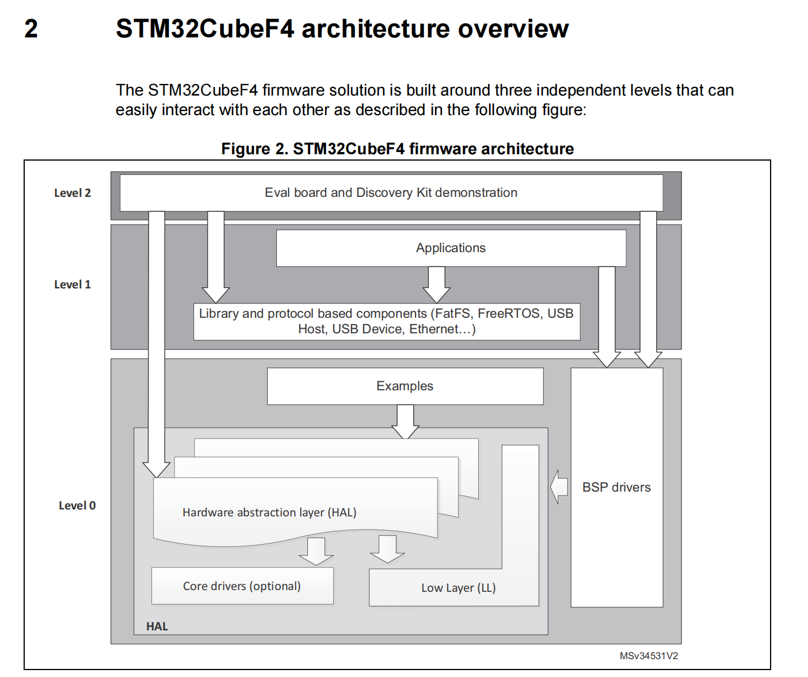
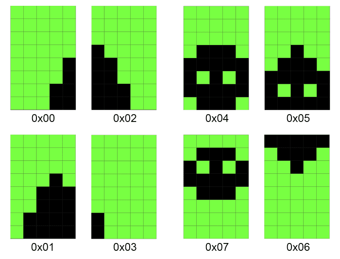

# 🦖 STM32 T-Rex Runner: An Embedded Real-Time System

> A faithful implementation of the classic Chrome Dino game on the STM32F446xx microcontroller, featuring a custom LCD1602 rendering engine and interrupt-driven architecture.




## 📖 Project Abstract

This project serves as a detailed case study in embedded systems design, porting the mechanics of the famous Chrome T-Rex Runner to the **STM32F446xx** platform.

Unlike simple loops often found in beginner projects, this implementation transforms a minimalist LCD1602 display into a constrained real-time rendering engine. By leveraging the microcontroller's hardware capabilities—specifically **Timer Interrupts** for deterministic timing and **External Interrupts (EXTI)** for low-latency input—we achieve fluid animation and responsive gameplay without blocking the CPU. The core challenge involves optimizing the game's state machine for limited **Custom Graphics RAM (CGRAM)** resources.

---

## 🛠 Hardware Requirements

* **Microcontroller:** STM32F446xx (e.g., Nucleo-F446RE)
* **Display:** LCD1602 (16x2 Character LCD)
* **Input:** Push Button (Connected to PC13)
* **Debugger:** ST-Link V2/V3

---

## 🔩 Hardware Platform: STM32F446xx

The choice of the STM32F446xx is central to this project, offering a powerful core and rich peripheral set ideal for real-time applications.

### Key Features
- **Core:** ARM Cortex-M4 running at up to 180 MHz.
- **Memory:** 512 KB Flash, 128 KB SRAM.
- **Peripherals:** Multiple timers, ADCs, DACs, and communication interfaces.

### Chip Architecture & Pinout

Below are diagrams detailing the architecture and pin definitions of the STM32F446xx, which are crucial for understanding the hardware connections and capabilities.

**STM32F4 MCU Package Structure:**


**Pin Definitions for the Chip:**


**Chip Data Link Architecture:**


**Firmware Components:**


**STM32CubeF4 Architecture Overview:**


---

## 🏗 Architectural Deep Dive

### 1. Real-Time Constraints & Timing
The game operates as a fixed-rate real-time system. We utilize hardware interrupts to decouple game logic from input handling, ensuring that heavy rendering tasks never delay input detection.

| Parameter | Configuration | Mechanism | C Language Entry Point |
| :--- | :--- | :--- | :--- |
| **Frame Rate** | **$20 \text{ FPS}$** ($50 \text{ms}$ interval) | **TIM1 Update Interrupt** | `HAL_TIM_PeriodElapsedCallback()` calls `Game_Core_Loop()` |
| **Input Latency** | Sub-millisecond | **PC13 EXTI Interrupt** | `HAL_GPIO_EXTI_Callback()` sets `jump_order` flag |
| **Synchronization** | Global `volatile` Flags | Used to communicate input commands between high-priority ISRs and application logic. | `extern volatile bool jump_order;` |

### 2. Repository Structure
The project adheres to the standard **STM32CubeIDE** file structure, keeping hardware abstraction separated from game logic.

```text
├── Core/
│   ├── Inc/
│   │   ├── dinogame.h           // Game state definitions and function prototypes
│   │   ├── lcd.h                // LCD struct and Low-level API declarations
│   │   └── main.h
│   └── Src/
│       ├── dinogame.c           // Core game logic, physics, and collision detection
│       ├── lcd.c                // LCD driver implementation and CGRAM bitmaps
│       ├── main.c               // MCU peripheral setup and main while(1) loop
│       └── stm32f4xx_it.c       // Interrupt Service Routines (TIM1, EXTI)
├── Drivers/                     // STM32 HAL Drivers
├── CMakeLists.txt               // Build configuration
└── STM32F446XX_FLASH.ld         // Linker script
```
## 💻 Code Logic and Implementation

### 1. Game State Machine (GSM)
Located in `dinogame.c`, the obstacle system mimics the original game's behavior. Visual movement is encoded in a **5-state cyclical transition** ($0$ to $4$) to simulate smooth scrolling on a blocky display.

* **Initialization:** `Game_Status_Init()` resets arrays, ensuring `grass_status[COL]` is zeroed.
* **Propagation:** The `Game_Update_Grass()` function executes transitions using in-place array modifications. It uses index skipping (e.g., `i = i + 2`) to prevent processing the same obstacle twice in one frame.

```c
// Example: Core Grass Logic (dinogame.c)
if (grass_status[i] == 1) {
    if (i == COL - 1) {
        // Handle end of screen
        return; 
    } else {
        grass_status[i] = 2;     // Current block transitions state
        grass_status[i + 1] = 4; // Next block prepares to render
        i = i + 2;               // Skip index to prevent double processing
    }
}
// Collision logic follows...
```
### 2. Physics & Character Rendering
The character uses a **16-step jump cycle** (`JUMP_CYCLE = 16`). The `display_jump_status` function maps specific points in this cycle to visual CGRAM frames to achieve animation:

| Jump Status Range | Row 0 (Top) | Row 1 (Bottom) | Visual Effect |
| :--- | :--- | :--- | :--- |
| $0$ | Space (' ') | `DINO_A` / `DINO_B` | Running/Standing (Ground) |
| $1 \to 4$ | `DINO_JUMP_BOTTOM` | `DINO_A` | Low Jump (Body Split) |
| $5 \to 11$ | `DINO_JUMP_TOP` | Space (' ') | Mid-High Jump (Body in Top Row) |

### 3. Asynchronous Input Handling
To achieve maximum responsiveness, button input is handled entirely in the interrupt context (ISR).

```c
// Example: EXTI Handler (stm32f4xx_it.c)
void HAL_GPIO_EXTI_Callback(uint16_t GPIO_Pin) {
    // ... Debouncing logic ...
    if (game_start == false) {
        game_start = true;
        Lcd_clear(&lcd); // Immediate feedback
    } else {
        jump_order = true; // Signal jump request to the core logic
    }
}
```

## 🎨 Graphics Implementation via CGRAM

The visual fidelity is achieved by exploiting the eight available Custom Graphics Character slots (CGRAM) in the HD44780 controller. The `Lcd_load_custom_chars()` function populates these slots during initialization.



### Custom Character Mapping

| CGRAM Address | Macro                  | Graphic Purpose                        | Defined In |
| :------------ | :--------------------- | :------------------------------------- | :--------- |
| 0x00 - 0x03   | `CHAR_GRASS_F0` - `F3` | Obstacle animation frames (encoded arrays) | `lcd.c`    |
| 0x04 - 0x07   | `CHAR_DINO_A` - `JUMP` | Dino run cycle and jump sequence       | `lcd.c`    |
🚀 Execution Protocol

### 1. Compilation
- **Toolchain:** Ensure ARM-None-EABI GCC and STM32 HAL libraries are configured.
- **Flags:** `-mcpu=cortex-m4 -mthumb`
- **Timer Config:** Verify `MX_TIM1_Init` settings match the 50 ms target (Prescaler and Period calculated based on APB2 clock).

### 2. Deployment
- Flash the generated `.elf` or `.bin` binary to the STM32F446xx target using the ST-Link utility or OpenOCD.

### 3. Controls
- **Boot:** The system initializes and displays a waiting prompt.
- **Start:** Press the User Button (PC13) to set `game_start = true`.
- **Play:** Press the button to trigger a jump (`jump_order = true`).
- **Score:** Survival time is tracked on the top line of the display.


## 🤝 Acknowledgements & References

This project is inspired by the numerous minimal implementations of the T-Rex Runner across various embedded platforms.

- **Original Concept:** Google Chrome's "No Internet" Game.
- **Logic Reference:** The complexity and state machine structure were largely inspired by the Python/Raspberry Pi implementation found here: [Chrome Dino Game on LCD1602 (Raspberry Pi)](https://github.com/ipython3/chrome-dino-game-lcd1602-raspberrypi?tab=readme-ov-file).
- **Other Implementations & Inspirations:**
  - [Arduino 1602 Snake Game](https://github.com/SadaleNet/Arduino1602Snake)
  - [Raspberry Pi LCD Runner](https://github.com/Blueve/RaspberryPiLCDRunner)
  - [Raspberry Pi I2C LCD1602 Tutorial](https://shumeipai.nxez.com/2020/06/17/raspberry-pi-drives-lcd1602-screen-through-i2c.html)
- **Disclaimer:** This is an educational project demonstrating embedded real-time logic and is not affiliated with Google.

